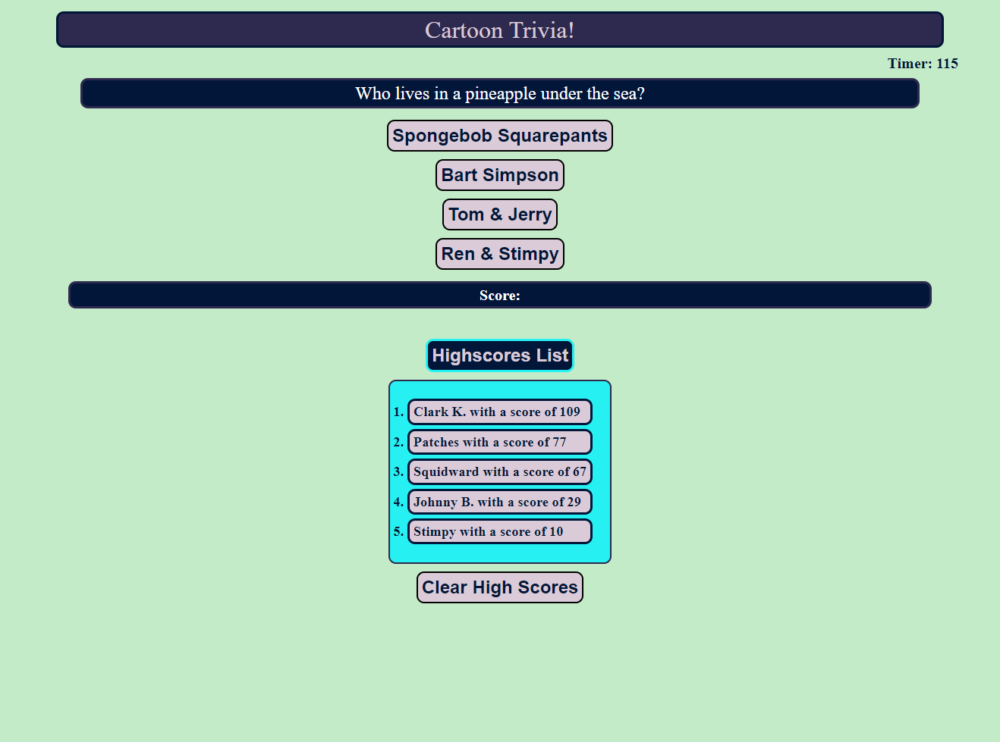

# cartoon-trivia-game 
A timed trivia game based on some of my favorite cartoons

Made in Javascript by jminor90

## Description

A short trivia application with a timer and a high scores feature, that I made to practice what I've learned in Javascript. Such as being able to manipulate local storage, and adding user interactivty with the website itself.

## Usage

- Click the "Start" button to begin the game and the timer will begin to tick down.
- Questions with 4 options will appear - click the choice you think best answers the question.
- Each question answered correctly will add +1 to the score. Any question answered incorrectly will have 5 seconds reduced from the timer.
- Once all available questions are answered or the timer reaches 0 the game will end.
- Your final score is determined by how many questions you answered correctly and the remainding time
- The application will prompt you for your name for the high scores list
- Click the "Highscores List" to view the top 5 high scores (saved in Local Storage)
- Double Click "Highscore List" to hide it from view
- "Clear High Scores" button will clear scores from local storage

[Click Here to Open](https://jminor90.github.io/cartoon-trivia-game/)

## Credits

Coded by Joshua Minor (jminor90)

Resources
- [MDN](https://developer.mozilla.org/en-US/docs/Web/JavaScript)

## License

The last section of a high-quality README file is the license. This lets other developers know what they can and cannot do with your project. If you need help choosing a license, refer to [https://choosealicense.com/](https://choosealicense.com/).
