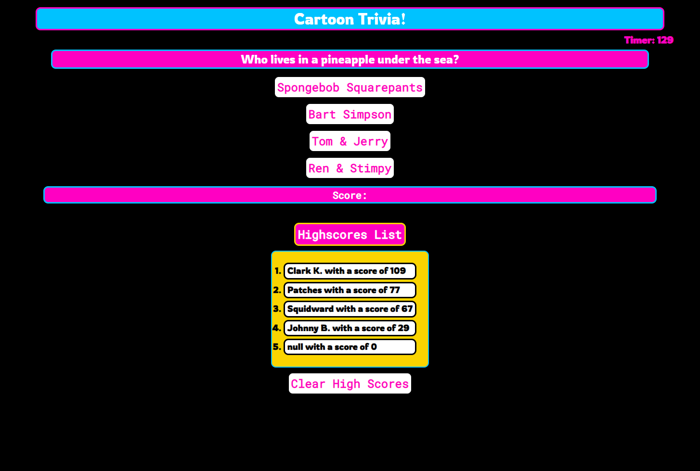

# cartoon-trivia-game 
A timed trivia game based on some of my favorite cartoons
Made in Javascript by jminor90

## Description

A short trivia application with a timer and a high scores feature, that I made to practice what I've learned in Javascript. Such as being able to manipulate local storage, and adding user interactivty with the website itself.

## Usage

Provide instructions and examples for use. Include screenshots as needed.

To add a screenshot, create an `assets/images` folder in your repository and upload your screenshot to it. Then, using the relative filepath, add it to your README using the following syntax:

## Credits

Coded by Joshua Minor (jminor90)

Resources
- [MDN](https://developer.mozilla.org/en-US/docs/Web/JavaScript)

## License

The last section of a high-quality README file is the license. This lets other developers know what they can and cannot do with your project. If you need help choosing a license, refer to [https://choosealicense.com/](https://choosealicense.com/).
